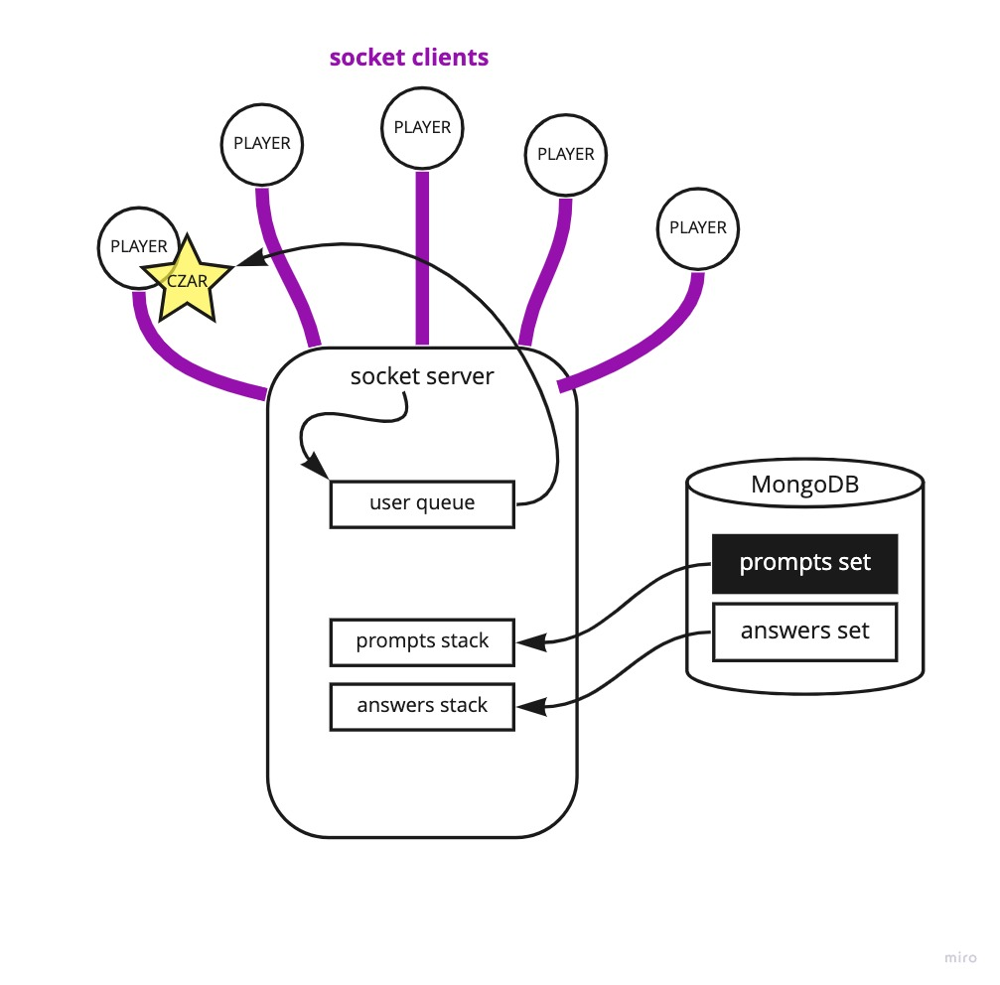

Seattle-code-401d45: Scott Lease, Keian Anthony, Emily Landers, Andrew Enyeart,

Code 401 Project: Prep #2 - Code against Sanity

## Project Summary

### Name of Project

**Cards Against Sanity**

### Summary of idea

Cards Against Sanity (CAS) is our idea of what that popular card game: Cards Against Humanity™ would look like if it was made in the eyes of a software developer. More specifically, one going through a coding boot-camp.

The rules of the game are fairly straightforward:

* Turn-based where every person starts (and always has) 7 "white" cards in their hands.
* One new person at the start of every round will draw a "black" card which has a blank somewhere on the string.
* The goal of everyone else (all but the 'card czar' - AKA the one holding the black card) is to find a white card they think is the most humorous to fill in the blank of the black card.
* Once all white cards have been submitted to the card czar, the card czar then chooses which white card they think is the most humorous in place of the blank.
* The person who submitted said white card gets a point, and then the next round starts and the next person in the line becomes the new card czar.

### Data Flow UML

