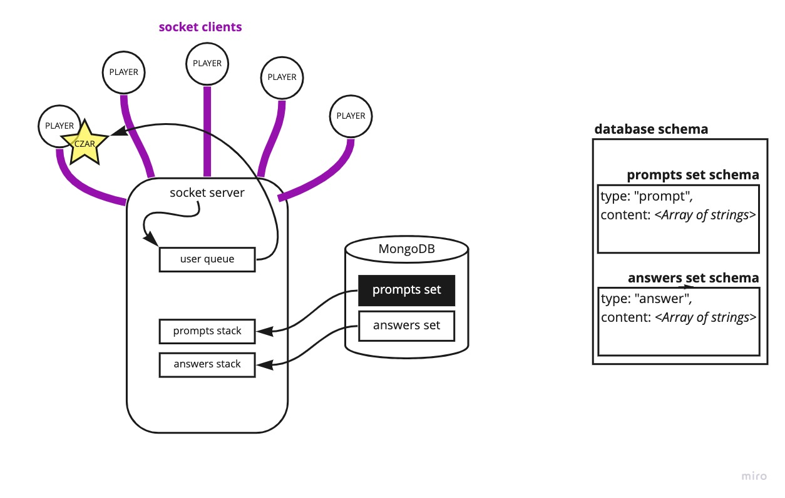
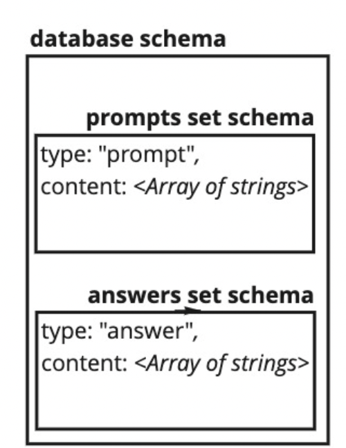

# Code Against Sanity

---

## We are deployed on Netlify and Server is on Heroku

Server link:
- https://code-against-sanity.herokuapp.com/

---

## Web Application

Code Against Sanity (CAS) is our idea of what that popular card game: Cards Against Humanity™ would look like if it was made in the eyes of a software developer. More specifically, one going through a coding boot-camp.

The rules of the game are fairly straightforward:

- Turn-based where every person starts, and every turn within a game, has 7 "white" cards in their hands.
- One new person at the start of every round will draw a "black" card which has a blank somewhere on the string.
- The goal of everyone else (all but the 'card czar' - AKA the one holding the black card) is to find a white card they think is the most humorous to fill in the blank of the black card.
- Once all white cards have been submitted to the card czar, the card czar then chooses which white card they think is the most humorous in place of the blank.
- The person who submitted said white card gets a point, and then the next round starts and the next person in the line becomes the new card czar.

---

## Tools Used

Microsoft Visual Studio

- Node.js
- Socket.io
- MongoDB
- Heroku

---

## Getting Started

Clone this repository to your local machine.

```bash
# In the root-directory level of this application, in your terminal, run the following
> git clone git@github.com:CodeAgainstSanity/CAS-backend.git 
```

Once downloaded, you can either use the dotnet CLI utilities or Visual Studio 2017 (or greater) to build the web application.

```bash
# In the root-directory level of this application, in your terminal, run the following
> npm update
```

All dependencies used in this project.
(Any additional others added in the future which may not be seen here can be found in the package.json file under `dependencies`)

* dotenv
* socket.io
* socket.io-cli
* MongooseDB

---

### Database

In this application we use MongoDB Atlas.

As such, our application requires an environment variable to connect a database to, and create / read card data to / from, respectively.

A file should be created at the root level of the project named:

`.env`

This file should contain the line:

`MONGODB_URI=mongodb+srv://<username>:<password>@cluster0.ppnik.mongodb.net/myFirstDatabase?retryWrites=true&w=majority`

* For privacy reasons, we will *not* display or give out our string containing the username and password we use for development.
* `<username>` and `<password>` should be changed out with an appropriate username and password for a personal account created on MongoDB Atlas.

Make sure there is ***no*** whitespace between any variables creates in this file

### Launching the server

```js
cd CAS-backend
node src/server.js <totalPlayers> <maxPoints>
```

`totalPlayers` and `maxPoints` are optional arguments when launching the socket server and they must be integers. If omitted, they default to `3` and `2` respectively:

```js
// In ./src/server.js at global variable declarations at top of file:
const totalPlayers = process.argv[2] || 3;
const maxPoints = process.argv[3] || 2
```

* In order to change between the client communicating with the live-deployment and a locally-ran server is to change the commented out connection string at the top of the `./client/mock-client.js` file.

---

## Usage

1. Once you have the depenancies updated, shown above as how to 'build the web application,' you can launch the `./client/mock-client.js` file by executing the line: `node ./client/mock-client.js` in your terminal in the root directory of the project.

1. If you wanted to run the program by yourself, you could simply run the same command in three other terminal windows.

1. If you wanted to run this program with other people, they would have to complete step #1, listed above, themselves.

### Overview of Game


---

## Data Flow

The socket server connects to individual clients (a minimum of four), each client represents a player which will be added to a player queue. The server communicates with the database for the prompts/black cards each round, and for the initial answers/white cards which will be replenished after each round.



---

## Data Model

### Overall Project Schema

***Both the prompts/black cards, and the answers/white cards are stored within our database schema as strings***


---

## Authors

- Keian Anthony - [Keian's Github](https://github.com/Keian-A)
- Scott Lease - [Scott's Github](https://github.com/scottie-l)
- Andrew Enyeart - [Andrew's Github](https://github.com/aenyeart)
- Emily Landers - [Emily's Github](https://github.com/Emily-Landers)
